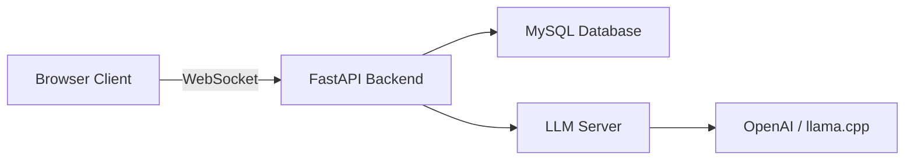

# Realtime Chat LLM Bot

[](LICENSE)
[]()

> Real-time group chat with an integrated LLM bot — FastAPI, WebSockets, MySQL, and a vanilla JS frontend.

---

## Problem

Team chat tools rarely integrate AI assistance natively. Building a real-time messaging system with an LLM bot requires coordinating WebSockets, persistence, auth, and an OpenAI-compatible inference server.

## Solution

A full-stack group chat web app where users join rooms, send messages in real time, and interact with an LLM bot backed by any OpenAI-compatible server (OpenAI, llama.cpp, etc.).



## Tech Stack

| Layer | Tools |
|-------|-------|
| Backend | FastAPI, WebSockets, Python |
| Database | MySQL |
| Frontend | Vanilla HTML/CSS/JS |
| LLM | OpenAI-compatible API (llama.cpp default) |

## Quick Start (Dev)

```bash
# 1) MySQL — create DB & user, or run sql/schema.sql

# 2) Backend
cd backend
python -m venv .venv && source .venv/bin/activate  # Windows: .venv\Scripts\activate
pip install -r requirements.txt
cp ../.env.example ../.env

# 3) Run app
uvicorn app:app --host 0.0.0.0 --port 8000
```

Open http://localhost:8000

LLM endpoint defaults to `http://localhost:8001/v1` (llama.cpp server). Set `LLM_API_BASE`, `LLM_MODEL`, `LLM_API_KEY` in `.env` if needed.

## Project Structure

```
realtime-chat-llm-bot/
├── backend/
│   ├── app.py              # FastAPI + WebSocket routes
│   ├── auth.py             # Authentication
│   ├── db.py               # MySQL connection
│   ├── llm.py              # LLM bot integration
│   └── websocket_manager.py
├── frontend/
│   ├── index.html
│   ├── app.js
│   └── styles.css
└── sql/schema.sql
```

## License

MIT — see [LICENSE](LICENSE).

---

*Originally developed as USC DSCI 560 coursework — refactored for clarity and portfolio presentation.*
